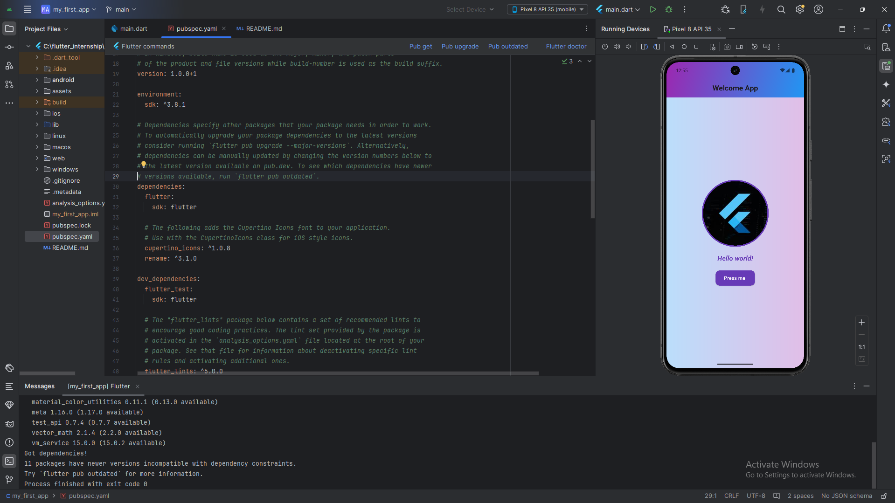

# App1

A new Flutter project.
🛠️ Widgets Used

MaterialApp → Root of the app, enables Material Design.

Scaffold → Basic page layout (AppBar + Body).

AppBar → Top navigation bar with gradient background.

Container → Used for body background (gradient) and circular image border.

Column → Arranges widgets vertically.

Center → Centers content on the screen.

Text → Displays the "Hello World!" message with styling.

SizedBox → Adds spacing between widgets.

Image.asset → Loads image from local assets.

SnackBar → Shows a temporary message when button is pressed.

ElevatedButton → Interactive button with custom styling.
## Getting Started

flutter run 
# My First Flutter App

This is my first Flutter app 🚀

## Screenshot

